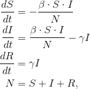
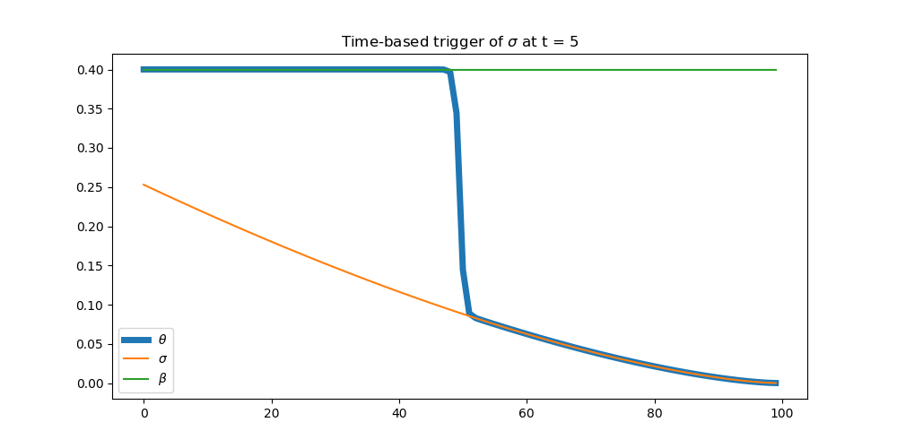
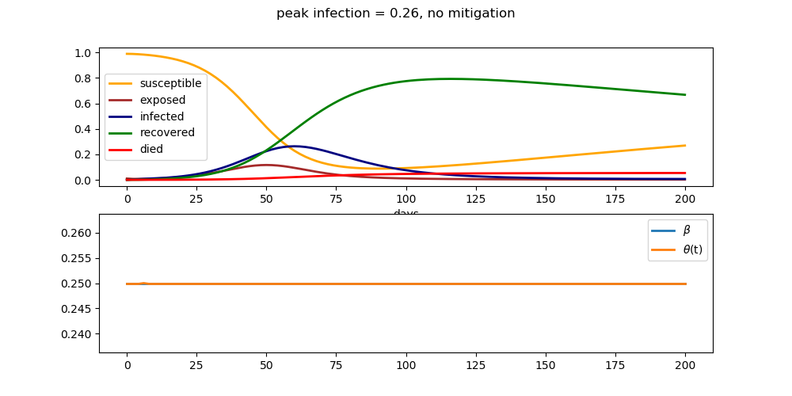
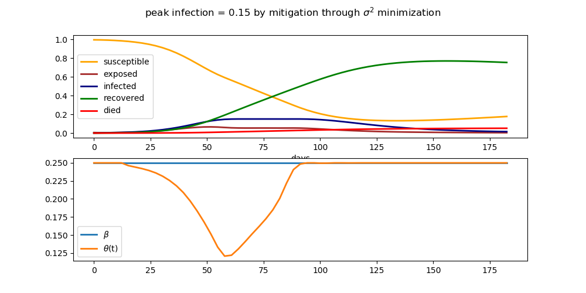
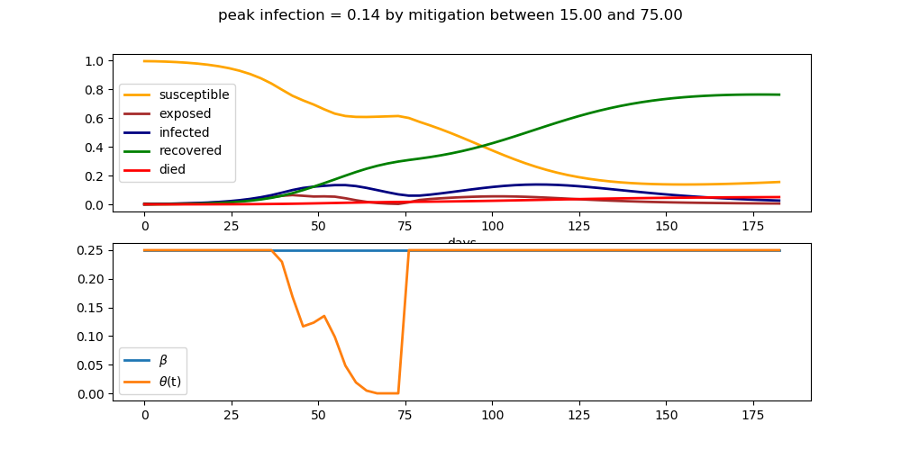

MDAO-Based Pandemic Countermeasure Optimization
========================================================

A Python-based set of tools for pandemic modeling with analytic derivatives, which allows for gradient-based  numerical optimization of infectious disease mitigation techniques (social distancing, etc.). The aim is to provide a set of tools to help inform or derive localized policy decisions relating to the spread of illnesses such as COVID-19. This will include prognostics of infection magnitude and health care service capacity planning. 

By adapting methods of optimizing large systems of coupled dynamical multidisciplinary systems commonly used in aerospace to the study of infectious diseases, we hope to introduce a novel analysis capability.

Developed using the dynamical systems optimization framework [Dymos](https://openmdao.github.io/dymos/), within the [OpenMDAO](https://openmdao.org/) Multidisciplinary Analysis and Optimization environment.

NOTE: We are by no means infectious disease experts, but rather pracitioners of numerical optimization and multidisciplinary systems analysis.

Installation
============
Requires OpenMDAO 3.0.0 and Dymos 0.15.0.
Install both by running:
```
python -m pip install git+https://github.com/OpenMDAO/dymos.git
```
Background
===========

In what is known as the SIR model, a simplified expression of the dynamics of an infectious disease is given by the system of differential equations



where `S`, `I`, and `R` represent the number of susceptible, infected, and recovered individuals within the population that a given disease may spread, and `N` denotes the total size of this population. The constants `beta` and `gamma` are respectively known as the contact rate and recovery rate, and control the dynamics of the spread of the disease. 

Adaptation of SIR model for optimal control
===============================

In order to represent this system in a form that can be analyzed in a system optimization context applicable to general infectious diseases, let us consider a dynamic optimization control `sigma(t)` to temporally reduce the natural contact rate of the disease `beta`, representing the application of mitigation policies (such as [Social Distancing](https://en.wikipedia.org/wiki/Social_distancing) measures).

Let us also more carefully consider the resolution of an infected individual, as one of two possibilities: recovery with immunity (i.e. assumption of a "recovered" state), or death `D`, an additional category of the model to be tracked and integrated. Let `gamma / T_inf.` be the recovery rate of the disease, divided by the average duration of the infection, which complimentary defines the mortality as `(1 - gamma) / T_inf.`. 

Similarly, let `T_imm` be the average duration of immunity to the disease granted by successful recovery. Then the rate of loss of immunity (and gain in susceptibility) can be established as `1 / T_imm`.

It would also be novel to explore the effect of potential mitigation strategies that begin at a specific time, rather than be available at the start of a particular simulation. In this way, the effect of a lag time on policy implementation can be estimated. Specifically, consider that the earliest the effect of `sigma(t)` can take place is some time `t_0`. Essentially, `sigma(t)` should be treated in a heterogeneous fashion that can be understood as "activating" and "deactivating" the control vector `sigma(t)` as a function of `t`. When not active, the default value of `beta` should be used within the ODE equations of state.

To implement this targeted control concept into the ODE system, note that the indicator function of the boolean `t > t_0` can be approximated with the continuous sigmoidal function 


where `a > 0` is a scale parameter.

Using this, we can define a filtered control `theta(t)` as the product of this estimate and the control signal `sigma(t)`


which balances between the default contact value `beta` and the control vector `sigma(t)` based on the condition `t > t_0`. This is a smooth function, and we can determine its derivatives with respect to its parameterization and all ODE state variables. For example:


The smoothness parameter `a` provides a means to address numerical conditioning of the indicator function estimator. This allows for the system to be amenable to gradient-based numerical optimization, despite the boolean condition on the control parameter `sigma(t)` of `t > t_0`. 

To illustrate this, let `beta = 0.4` be the default contact rate,  `sigma(t)` be a quadratic control vector to be manipulated by an optimizer, but with activation only after `t_0 = 5.0`. An example resulting effective contact rate `theta(t)` used for the ODE equations of state would be the blue curve below, smoothly blending `beta` and `sigma(t)` before and after `t_0`:




Now the modified ODEs of this system can be written as


The addition of `D` and `T_imm.` (immunity loss) will allow for consideration of mortality rates, and the possibilities relating to endemic cycling.


Implementation and example
===========================

The above equations were implemented in the dynamic systems optimization framework Dymos, which is built using the OpenMDAO optimization framework. 

As a baseline, the system can be run without the consideration of any type of mitigation strategy, i.e. constant `beta`, `gamma = 0.95`, and `T_inf = 14 (days)` and `T_imm = 300 (days)`.

This corresponds to the problem statement:

    Minimize: 
        - (None)
    With respect to: 
        - ODE state variables `S`, `I`, `R`, `D`
    Such that:
        - System begins at `S = 999500`, `I = 500`, `R = 0`, `D = 0`, `N = 1000000`
        - Solution satisfies ODE

When run, this establishes the baseline situation under the given parameters as:



This indicates a peak infection rate of over half the total population under consideration, around time `t = 28 (days)`.

Now, allowing for dynamic optimization representing social distancing implementation, let's optimize the scenario with respect to `sigma(t)` in order to flatten the infection curve below 15% of the population total at peak. Specifically, let's aim to find (in some sense) the least amount of mitigation necessary to reach this target. To do this, we can minimize the sum of the square of the mitigation vector `sigma(t)`.
We also specify that mitigation must begin only after `t_0 = 10.0`, to study the effect of lagging the mitigation policy. For `theta(t)`, we set a smoothness constant of `a = 10.0`


Following this, we get the formulation:

    Minimize: 
        - Sum of `sigma(t)^2`
    With respect to: 
        -`sigma(t)`
        - ODE state variables `S`, `I`, `R`, `D`
    Such that:
        - peak infection `I` is below 15% of the total population `N`
        - System begins at `S = 999500`, `I = 500`, `R = 0`, `D = 0`, `N = 1000000`
        - Solution satisfies ODE

as implemented in the problem definition of `run_min_sigma_sq.py`.
Running this gives the solution:



indicating successful flattening of the infection curve below the specified target, using a social distance infection mitigation strategy lasting around 65 days.

Example 2: direct peak curve minimization
==========================================

Next, consider a problem formulation where we seek to directly minimize the peak value of the infection curve, with mitigation `sigma(t)` applied strictly between two time points `t_on` and `t_off`. We'll limit the control to be a quadratic function of time, limited between days `t = 15` and `t = 55` of the simulation. Outside those times, the effective contact rate will default to the natural value for the disease & population.

First, we can adapt the above definition of effective time-constrained contact rate `theta(t)` to include the `t_off` parameter, by expressing the joint indicator function of the conditions `t > t_on` and `t < t_off` as the product of two smooth sigmoidal estimates. This provides a new expression for `theta(t)` as a function of `beta`, `sigma(t)`, `t_on`, and `t_off`:

 with t_on and t_off params.")

Though omitted here for brevity, this function also has continuous derivatives with respect to its parameters, and is thus suitable for gradient-based numerical optimization.

Next, we will aggregate the state variable representing the number of infected individuals within the model using the  Kreisselmeier-Steinhauser (KS) function, which provides a smooth estimate of `max(infected)`.

.")

With this, we get the optimization problem formulation:

    Minimize: 
        - Infection curve peak estimate KS(I)
    With respect to: 
        - Quadratic contact control `sigma(t)`, between t=15 and t=55 days
        - ODE state variables `S`, `I`, `R`, `D`
    Such that:
        - System begins at `S = 999500`, `I = 500`, `R = 0`, `D = 0`, `N = 1000000`
        - Solution satisfies ODE



With this, we see the infection peak curve being minimized with a slowly increasing level of mitigation between the specified times. The result is a bimodal infection curve, with the 2nd wave propogating with a flattened peak without any additional mitigation. Consequently, the recovery curve is nearly linear through the simulation.

Next steps 
===========
- Proper representation of incubation period between exposure and the ability to spread the infection
- Derivation of critical patient category, including hospitalized ICU versus unhospitalized categories
- Finer detailed calculation of the `sigma(t)` control parameter relating to social policy
- Calibration with real-world date related to the spread of COVID-19
